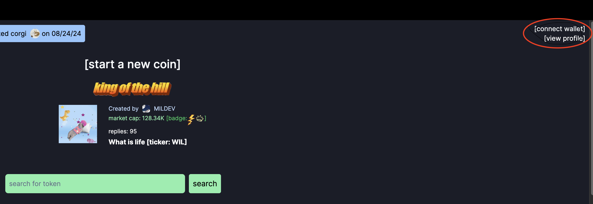
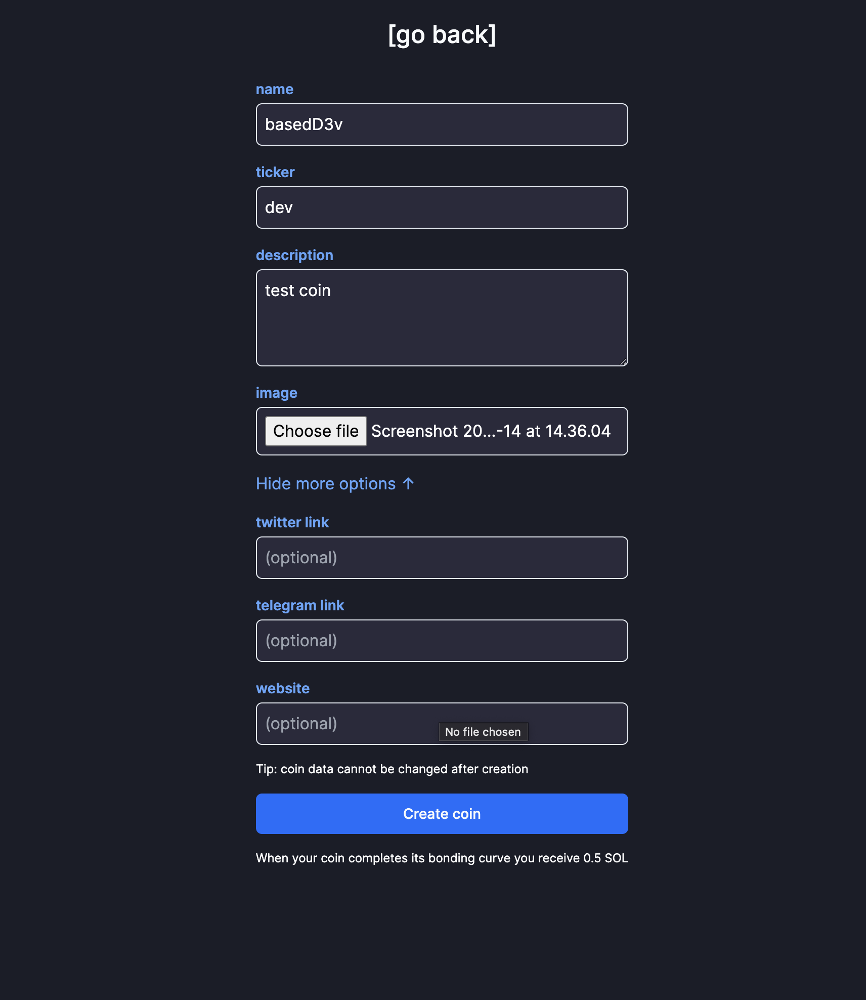
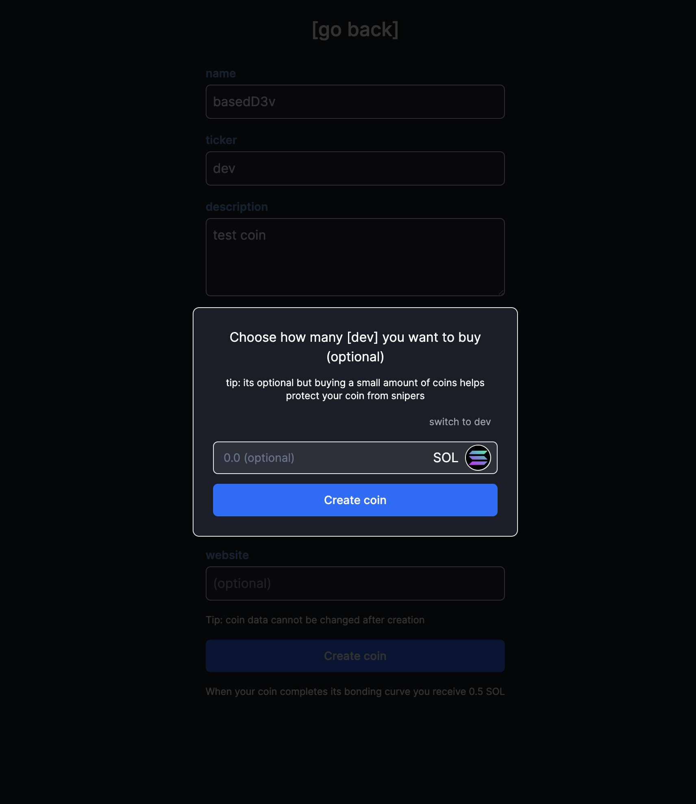

# Introduction: What is pump.fun?
   pump.fun is an token launching and trading platform built on the Solana blockchain.

   The platform's trading mechanism follows traditional supply and demand principles: token prices rise as buying pressure increases and fall as selling pressure mounts. 
   
   However, what sets pump.fun apart are its unique features designed to promote fairness and prevent common pitfalls in the cryptocurrency space. Let's delve into some key concepts:

   ## Fair Launch: 
   
   Tokens are made available to the public without any preferential treatment or early access. In contrast, many cryptocurrency projects conduct presales, where a select group of investors can purchase tokens at a discounted rate before the public launch. Fair launches eliminate this advantage, giving everyone an equal opportunity to participate from the start.

   ## No Presale: 
   The platform doesn't offer presales, which are common in many cryptocurrency projects. A presale, also known as a private sale or initial coin offering (ICO), is a fundraising event where tokens are sold to a select group of investors before the public launch. Presales often offer tokens at a discounted rate, allowing early investors to acquire a large number of tokens at a lower price. While presales can help projects raise initial capital, they often create an uneven distribution of tokens, with early investors gaining a significant advantage over the general public. This can lead to market manipulation and unfair price movements when the token is publicly traded. By avoiding presales, pump.fun aims to distribute tokens more equitably among all interested parties, ensuring a fairer launch and more balanced token distribution from the start.

   ## No Team Allocation: 
   Many cryptocurrency projects allocate a portion of the token supply to the development team or founding members. While this can incentivize long-term commitment, it can also lead to centralization of token ownership and potential market manipulation. pump.fun eliminates team allocations, ensuring that all tokens are available to the public. This reduces the risk of large holders disproportionately influencing the market.

   ## Rug Pull Prevention: 
   "rug pull" is a type of scam where project developers abandon the project and abscond with investors' funds. This typically involves creating hype around a new token, encouraging investment, and then suddenly selling off all holdings, causing the token's value to plummet. 
   
   Rug pulls are particularly prevalent in the DeFi (Decentralized Finance) space 
   
   pump.fun implements unique techniques to prevent rug pulls, adding an extra layer of security for token investors and enhancing the platform's trustworthiness for token launches.

   By incorporating these features, pump.fun aims to create a more transparent, fair, and secure environment for token launches and trading.

# Launching Tokens on pump.fun

## Steps to Launch

1. **Connect Your Wallet**

2. **Choose Token Parameters**
   - Name
   - Ticker
   - Description
   - Image
   - Optional: Add links to Twitter, Telegram, website

3. **Launch the Token**
   - Click on "Create coin" and you're live!
   - Behind The Scenes, pump launches a [solana contract](https://solana.com/developers/guides/getstarted/how-to-create-a-token#creating-the-token-mint-account) with your metadata and creates your token
   - When launching, pump asks: "Choose how many of your tokens you want to buy (optional)"
   

   - Although optional, buying a small amount of coins helps protect your coin from **snipers**

      ### Understanding Snipers

      Snipers in token launches are bots or quick traders that attempt to buy large amounts of new tokens immediately upon launch. This can lead to several issues:

      1. Rapid price inflation
      2. Unfair distribution, preventing regular buyers from purchasing at a reasonable price
      3. Potential for sudden price crashes when snipers sell for quick profits
      4. Overall market instability for the new token

      To mitigate this, consider buying a small portion of your own token at launch. This acts as a protective measure against immediate price manipulation by snipers.

## Bonding Curve Explained

A bonding curve is a mathematical function defining the relationship between a token's price and its supply. It's used to create fair and transparent token distribution.

### ELI5
Imagine you have a magic sneaker machine. This machine is special because:

It never runs out of sneakers(because of something called liquidity).
The more sneakers people buy, the more expensive each sneaker becomes.

Here's how it works:

The first sneaker might cost just ₹1,000.

After 10 people buy sneakers, each new sneaker might cost ₹5,000.

After 100 people buy, each new sneaker might cost a ₹25,000.

If 1,000 people buy, each new sneaker could cost ₹1,00,000!

But here's the really cool part:

If you want to return your sneaker, the machine will always buy it back.
The price it pays depends on how many sneakers are left in the world.

In crypto:

The sneakers are like crypto tokens.
The machine is like a smart contract (a computer program).
The changing price is the "bonding curve".

### Basic Concept

Price = f(Supply)

Where f is a mathematical function.

### Common Types of Bonding Curves

1. **Linear**: Price = m * Supply + b
   - m: slope
   - b: y-intercept

2. **Exponential**: Price = a * e^(b * Supply)
   - a, b: constants
   - e: Euler's number

3. **Polynomial**: Price = a * Supply^n
   - a: constant
   - n: degree of the polynomial

### Example: Quadratic Curve

Let's use a simple quadratic curve: Price = 0.0001 * Supply^2

Sample calculations:
- At 10 tokens: Price = 0.0001 * 10^2 = 0.01
- At 100 tokens: Price = 0.0001 * 100^2 = 1
- At 1000 tokens: Price = 0.0001 * 1000^2 = 100

### Buying and Selling Mechanics

- Buying tokens: Move right on the curve, increasing supply and price
- Selling tokens: Move left on the curve, decreasing supply and price

### Calculating Cost to Buy

To buy tokens from supply S1 to S2:
Cost = ∫(S1 to S2) 0.0001 * x^2 dx
     = [0.0001 * x^3 / 3](S1 to S2)
     = (0.0001/3) * (S2^3 - S1^3)

Example: Cost to buy tokens 100 to 200
= (0.0001/3) * (200^3 - 100^3)
= 233.33

People buy tokens hoping their value will go up as more people want them. They can always sell them back, but the price might be different from what they paid.
This way, everyone has a fair chance to get tokens, and there's always a way to buy or sell them.

### Continuous Liquidity

The area under the curve represents the total amount of currency in the reserve pool. This system creates an automatic market maker where price adjusts based on supply, incentivizing early adopters and creating a fair distribution mechanism.

### If it gets too jarring, feel free to stop reading beyond this point.
----
**Liquidity Burning**:
Burning liquidity means permanently removing it from circulation. In this context, when $12k of liquidity is deposited in Raydium (a decentralized exchange) and then burned, it's locked forever and can't be withdrawn.

Why burn liquidity?
1. Price stability: It reduces sell pressure and potential price manipulation.
2. Trust: It shows commitment to the project's longevity.
3. Scarcity: It can increase the value of remaining tokens.

Example:
Imagine there are 1000 tokens, each worth $1. If 100 tokens (10%) are burned, the remaining 900 tokens might now be worth $1.11 each.

This system aims to create a fair launch environment with built-in price discovery and liquidity. The bonding curve allows for gradual price increase as more people buy in, while burning liquidity helps stabilize the price and build trust in the project.

Scenario 1: Without Burning Tokens

Initial state:
- Total tokens: 1000
- Price per token: $1
- Total market cap: 1000 * $1 = $1000

If demand increases and the market cap rises to $1100:
- Total tokens: 1000 (unchanged)
- New market cap: $1100
- New price per token: $1100 / 1000 = $1.10

Scenario 2: With Burning Tokens

Initial state:
- Total tokens: 1000
- Price per token: $1
- Total market cap: 1000 * $1 = $1000

After burning 10% (100) of tokens:
- Remaining tokens: 900
- Market cap remains $1000 (burning doesn't directly affect market cap)
- New price per token: $1000 / 900 ≈ $1.11

If demand increases and the market cap rises to $1100:
- Total tokens: 900 (unchanged after burn)
- New market cap: $1100
- New price per token: $1100 / 900 ≈ $1.22

Comparison:

1. Without burning:
   - Price increased from $1.00 to $1.10 (+10%)

2. With burning:
   - Price increased from $1.00 to $1.11 (+11%) just from burning
   - Then increased to $1.22 (+22% total) with the same market cap increase

This demonstrates how token burning can amplify price increases. With fewer tokens in circulation, each token represents a larger share of the total market cap, potentially leading to higher price appreciation when demand increases.

Let me expand on that concise insight:

1. Basic principle:
   Burning tokens reduces the total supply.

2. Supply and demand:
   With less supply and the same demand, each remaining token becomes more valuable.

3. Simple analogy:
   Imagine you have 10 slices of pizza for 10 people. If you remove 2 slices, now 10 people compete for 8 slices, making each slice more "valuable".

4. In token economics:
   - Before burn: 1000 tokens at $1 each
   - After 10% burn: 900 tokens at $1.11 each (approximately)

5. Impact on price movements:
   Future price changes have a more pronounced effect on a smaller supply. A $100 increase in market cap would raise the price more with 900 tokens than with 1000.

This mechanism is often used in cryptocurrency projects to create scarcity and potentially drive up value. However, it's important to note that burning alone doesn't guarantee price increase – market dynamics and project fundamentals still play crucial roles.
